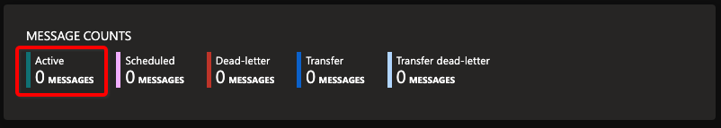
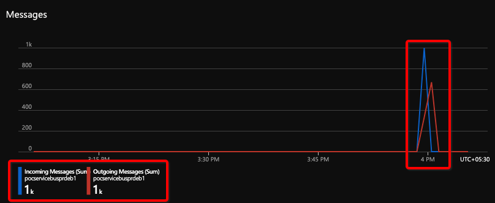

# Sample Python KEDA Service Bus Scaler

Sample Code for Python based Kubernetes Jobs for Event-driven Autoscaling using KEDA Azure Service Bus Scaler. 

## Prerequisite

1. [Azure Subscription](https://azure.microsoft.com/en-in/free/)
1. [AKS Cluster](https://docs.microsoft.com/en-us/azure/aks/kubernetes-walkthrough-portal)
1. [Azure Service Bus](https://docs.microsoft.com/en-us/azure/service-bus-messaging/service-bus-messaging-overview)
1. [Python 3](https://www.python.org/downloads/)
1. [Kubernetes CLI (kubectl)](https://kubernetes.io/docs/tasks/tools/#kubectl)

## Setup

1. Create an [Azure Service Bus Queue](https://docs.microsoft.com/en-us/azure/service-bus-messaging/service-bus-quickstart-portal)
1. [Deploy KEDA 2.0+](https://keda.sh/docs/2.3/deploy/) in AKS Cluster
1. Get the Azure Service Bus [connection string](https://docs.microsoft.com/en-us/azure/service-bus-messaging/service-bus-quickstart-portal#get-the-connection-string)
1. Get base64 encoded values of -
    1. Connection String: `echo -n "<connection string>" | base64`
    1. Queue Name: `echo -n "<queue name>" | base64`
1. Modify the following configuration files -
    1. [keda-config/jobs/secret.yaml](keda-config/jobs/secret.yaml): update `servicebus-queue` and `servicebus-connectionstring` by the values from above commands

        ```yml
        data:
            servicebus-queue: <base64_encoded_servicebus_queue_name>
            servicebus-connectionstring: <base64_encoded_servicebus_connection_string>
        ```

    1. [keda-config/jobs/keda.yaml](keda-config/jobs/keda.yaml): update `servicebus_queue_name` and `servicebus_namespace` with plain text values of respective queue name and namespace name

        ```yml
          triggers:
          - type: azure-servicebus
            metadata:
              # Required: queueName OR topicName and subscriptionName
              queueName: <servicebus_queue_name>
              # Required: Define what Azure Service Bus to authenticate to with Managed Identity
              namespace: <servicebus_namespace>
        ```

1. Deploy the KEDA enabled Sample Kubernets Job (in `default` namespace)

```bash
kubectl apply -f keda-config/jobs/secret.yaml
kubectl apply -f keda-config/jobs/keda.yaml
```

1. Verify deployment

```bash
~/sample-python-keda-service-bus-scaler(main*) » kubectl get ScaledJob
NAME                             MAX   TRIGGERS           AUTHENTICATION                READY   ACTIVE   AGE
servicebus-queue-so-sample-job   100   azure-servicebus   auth-service-bus-sample-job                    1s
--------------------------------------------------------------------------------------------------------------
~/sample-python-keda-service-bus-scaler(main*) » kubectl get TriggerAuthentication
NAME                          PODIDENTITY   SECRET              ENV
auth-service-bus-sample-job                 sample-job-secret
```

## Test

1. Populate message in Azure Service Bus Queue
    1. Modify the following configuration file -
        1. [test-message-creator/azure-service-bus.yaml](test-message-creator/azure-service-bus.yaml): update `servicebus_queue_name` and `servicebus_connection_string` with plain text values of respective queue name and connection string
    1. Execute -

        ```bash
        pip3 install -r requirements.txt
        cd test-message-creator && python3 send_message_queue.py
        ```

    1. Expected result -

    ```bash
    [07/Jun/2021 15:57:45] INFO - Start sending messages
    .........
    [07/Jun/2021 15:57:53] INFO - Sent a list of 1000 messages
    .........
    [07/Jun/2021 15:57:53] INFO - Done sending messages
    [07/Jun/2021 15:57:53] INFO - -----------------------
    ```

1. Monitor AKS Cluster and Azure Service Bus Queue
    1. Monitor AKS Cluster and check if the Job (100) got created as soon as there are messages populated in Azure Service Bus Queue

        ```bash
        ~/sample-python-keda-service-bus-scaler(main*) » kubectl get pods --selector=app=sample-keda-job | grep -v '^NAME' | wc -l
            100
        --------------------------------------------------------------------------------------------------------------
        ~/sample-python-keda-service-bus-scaler(main*) » kubectl get pods
        NAME                                         READY   STATUS      RESTARTS   AGE
        servicebus-queue-so-sample-job-26htm-hw7cm   0/1     Completed   0          2m21s
        servicebus-queue-so-sample-job-26pk7-8sw8g   0/1     Completed   0          2m52s
        ........
        servicebus-queue-so-sample-job-6jp7k-q9tv7   0/1     Completed   0          2m41s
        servicebus-queue-so-sample-job-6qrjg-pfx5n   0/1     Completed   0          2m47s
        --------------------------------------------------------------------------------------------------------------
        ~/sample-python-keda-service-bus-scaler(main*) » kubectl logs servicebus-queue-so-sample-job-xxfvj-l4t86
        started receiving message
        =========================
        Message in list 960
        Message in list 961
        Message in list 962
        Message in list 963
        Message in list 964
        Message in list 965
        Message in list 966
        Message in list 967
        Message in list 968
        Message in list 969
        =========================
        completed receiving message
        ```

    1. Check for [Messages](https://docs.microsoft.com/en-us/azure/service-bus-messaging/message-browsing) in Azure Service Bus Respective Queue
        1. Message Count
            
        1. Message Incoming / Outgoing
            

## (Optional) Build

1. The existing [source](/src-message-consumer/receive_message_queue_job.py) is built and uploaded to registry - `docker.pkg.github.com/prabdeb/sample-python-keda-service-bus-scaler/consumer:latest`
1. However if there is any modifications in source code, the docker image can be build by command - `docker build -t sample-python-keda-service-bus-scaler:latest -f Dockerfile-job .`

## Cleaning up resources

1. Delete sample application

    ```bash
    kubectl delete -f keda-config/jobs/keda.yaml
    kubectl delete -f keda-config/jobs/secret.yaml
    ```

1. [Uninstall KEDA 2.0+](https://keda.sh/docs/2.3/deploy/#uninstall)
1. [Delete Azure Resources](https://docs.microsoft.com/en-us/azure/azure-resource-manager/management/delete-resource-group?tabs=azure-portal)
